# 安装

## docker

```bash
docker pull mongo:latest

sudo mkdir -p /root/mongodb/datadb

sudo chmod 777 -R /root/mongodb/datadb

docker run -d --name mongodb -p 27018:27017 -v /root/mongodb/datadb:/data/db -e MONGO_INITDB_ROOT_USERNAME=hsiangya -e MONGO_INITDB_ROOT_PASSWORD=xy159951 --privileged=true --restart always mongo
```

## Ubunutu

```bash
sudo apt update && sudo apt upgrade -y

sudo apt install mongodb

sudo systemctl status mongodb
sudo systemctl stop mongodb
sudo systemctl start mongodb
sudo systemctl restart mongodb

# 是否跟随系统启动，默认启用
sudo systemctl disable mongodb
sudo systemctl enable mongodb

# shell
mongo

# 卸载
sudo systemctl stop mongodb
sudo apt purge mongodb
sudo apt autoremove

# 创建用户
use admin
db.createUser(
  {
    user: "username",
    pwd: "password",
    roles: [ { role: "root", db: "admin" } ]
  }
)
db.auth("usernam","password") # 验证是否成功

# 配置信息
sudo vim /etc/mongod.conf

# 开启身份验证\本地bing 127.0.0.1改成0.0.0.0
security:
  authorization: enabled
```


# 基本操作

## 认证

### 进入mongo

```bash
# 启动时开启认证
mongod -f /data/mongodb_data/27017/conf/mongodb.conf --fork --auth

# 登录时
mongo -u hsiangya -p xy159951 --authenticationDatabase admin
```


### 内置权限

| Permission           | Description                                                  |
| -------------------- | ------------------------------------------------------------ |
| root                 | 只在admin数据库中可用。拥有对MongoDB的所有权限               |
| read                 | 允许用户读取指定数据库                                       |
| readWrite            | 允许用户读写指定数据库                                       |
| dbAdmin              | 允许用户在指定数据库中执行管理函数，如索引创建、删除，查看统计或访问system.profile |
| dbOwner              | 允许用户对指定库的所有能力，包含readWrite、dbAdmin、userAdmin这些角色的权限 |
| userAdmin            | 允许用户向system.users集合写入，可以找指定数据库里创建、删除和管理用户 |
| clusterAdmin         | 只在admin数据库中可用，赋予用户所有分片和复制集相关函数的管理权限 |
| readAnyDatabase      | 只在admin数据库中可用，赋予用户所有数据库的读权限            |
| readWriteAnyDatabase | 只在admin数据库中可用，赋予用户所有数据库的读写权限          |
| userAdminAnyDatabase | 只在admin数据库中可用，赋予用户所有数据库的userAdmin权限     |
| dbAdminAnyDatabase   | 只在admin数据库中可用，赋予用户所有数据库的dbAdmin权限       |

### 内置角色

| Role           | Description                                                  |
| :------------- | :----------------------------------------------------------- |
| 超级用户角色   | root                                                         |
| 数据库用户角色 | read、readWrite                                              |
| 数据库管理角色 | dbAdmin、dbOwner、userAdmin                                  |
| 集群管理角色   | clusterAdmin、clusterManager、clusterMonitor、hostManager    |
| 备份恢复角色   | backup、restore                                              |
| 所有数据库角色 | readAnyDatabase、readWriteAnyDatabase、userAdminAnyDatabase、dbAdminAnyDatabase |

### 认证

| Name                                                         | Description                          |
| :----------------------------------------------------------- | :----------------------------------- |
| [`db.auth()`](https://docs.mongodb.com/v3.6/reference/method/db.auth/#db.auth) | 向数据库验证用户                     |
| [`db.changeUserPassword()`](https://docs.mongodb.com/v3.6/reference/method/db.changeUserPassword/#db.changeUserPassword) | 更改现有用户的密码                   |
| [`db.createUser()`](https://docs.mongodb.com/v3.6/reference/method/db.createUser/#db.createUser) | 创建一个新用户                       |
| [`db.dropUser()`](https://docs.mongodb.com/v3.6/reference/method/db.dropUser/#db.dropUser) | 删除一个用户                         |
| [`db.dropAllUsers()`](https://docs.mongodb.com/v3.6/reference/method/db.dropAllUsers/#db.dropAllUsers) | 删除与数据库关联的所有用户           |
| [`db.getUser()`](https://docs.mongodb.com/v3.6/reference/method/db.getUser/#db.getUser) | 返回有关指定用户的信息               |
| [`db.getUsers()`](https://docs.mongodb.com/v3.6/reference/method/db.getUsers/#db.getUsers) | 返回有关与数据库关联的所有用户的信息 |
| [`db.grantRolesToUser()`](https://docs.mongodb.com/v3.6/reference/method/db.grantRolesToUser/#db.grantRolesToUser) | 向用户授予角色及其特权               |
| [`db.revokeRolesFromUser()`](https://docs.mongodb.com/v3.6/reference/method/db.revokeRolesFromUser/#db.revokeRolesFromUser) | 从用户删除角色                       |
| [`db.updateUser()`](https://docs.mongodb.com/v3.6/reference/method/db.updateUser/#db.updateUser) | 更新用户数据                         |

## 数据类型

| 类型       | 说明                                                         |
| ---------- | ------------------------------------------------------------ |
| null       | 控制或不存在的字段                                           |
| 布尔       | true和false                                                  |
| 32位整数   | shell不支持，JS仅支持64位浮点数，32位整数会被自动转换        |
| 64位整数   | shell不支持，shell使用一个特殊的内嵌文档来显示64位整数       |
| 64位浮点数 | shell中的数字都是这种类型。{"x":3}中的3是浮点数              |
| 字符串     | UTF-8字符串都可表示位字符串的数据                            |
| 符号       | shell不支持，shell将数据库里的符号类型转换为字符串           |
| 对象id     | 对象di是文档的12字节的唯一ID                                 |
| 日期       | 日期类型存储的是从标准纪元开始的毫秒数，不存储时区           |
| 正则表达式 | 文档中可以包含正则表达式，采用JS的正则表达式语法，{"x":/foobar/i} |
| 代码       | 文档中还可以包含JS代码                                       |
| 二进制数据 | 二进制数据可以由任意字节的串组成，不过shell中无法使用        |
| 最大值     | BSON包括一个特殊类型，表示可能的最大值，shell中没有该类型    |
| 最小值     | BSON包括一个特殊类型，表示可能的最小值，shel中没有该类型。   |
| 未定义     | 文档中也可以使用未定义类型                                   |
| 数组       | 值得集合或者列表可以表示成数组                               |
| 内嵌文档   | 文档可以包含别的文档，也可以作为值嵌入到父文档中             |

- Mongdb由3中数字类型(32位整数、64位整数、64位浮点数)
- shell中得数字都被MongoDB当作是双精度数
- 从数据库中获得的是32位整数，修改文档后，存回数据库时，这个整数也被转换成浮点数，即便原封不动。
- 尽量不要在shell下覆盖整个文档

## CRUD

**insert：**

- `db.<集合>.insertOne(<json对象>)`
- `db.<集合>.insertMany([<JSON 1>,<JSON 2>,......<JSON n>])`

**find:**

- 返回的是游标对象

**remove**:

- 一定要指定条件，不指定条会将整个文档删除

**update**:

- `db.<集合>.update(<查询条件>,<更新字段>)`
  - $push：增加一个对象到数组底部
  - $pushAll：增加多个对象到数组底部
  - $pop：从数组底部删除一个对象
  - $pull：如果匹配指定的值，从数组中删除相应的对象
  - $pullAll：如果匹配任意的值，从数据中删除相应的对象
  - $addToSet：如果不存在则增加一个值到数组

**drop:**

- `db.<集合>.drop()`
- 删除一个集合，集合中的全部文档都会被删除

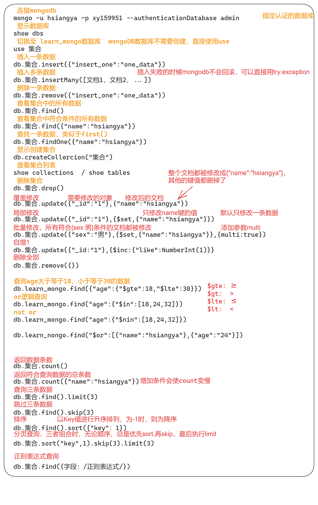

## 索引创建与删除

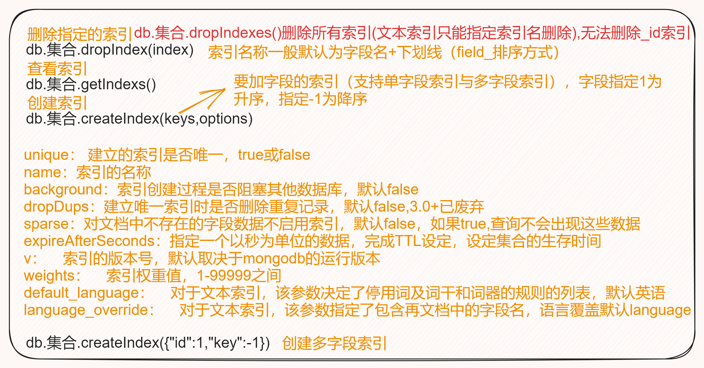

## 事物操作

### 写事物操作

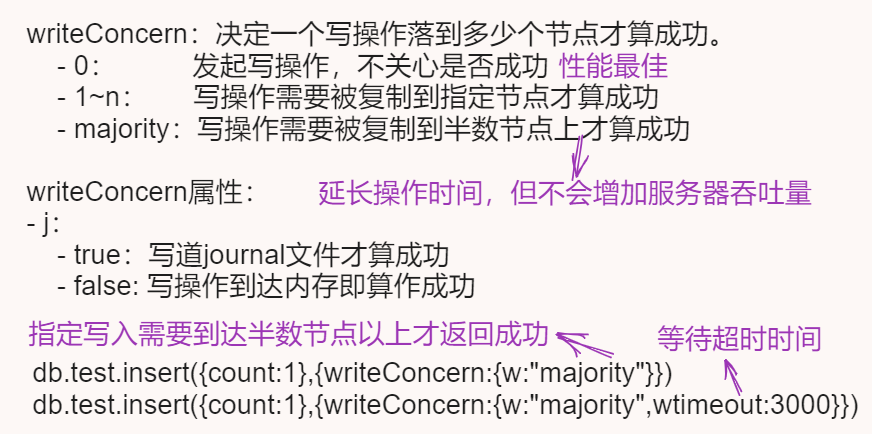

### 读事物操作


## 聚合

### 简介

mongodb聚合框架是一个计算框架，它可以：

- 作用在一个或几个集合上
- 对集合中的数据进行一系列运算
- 将这些数据转化为期望的形式

从效果而言，聚合框架相当于SQL查询中的：

- GROUP BY
- LEFT OUTER JOIN
- AS等

整个聚合运算过程成为管道（Pipeline），他是由多个步骤（Stage）组成的，每个管道：

- 接受一系列文档（原始数据）
- 每个步骤对这些文档进行一系列运算
- 结果文档输出给下一个步骤


### stage

```bash
pipeline = [$stage1, $stage2, $stage3,....,$stageN]
db.<collection>.aggregate(pipeline, {options});
```

| 步骤          | 作用     | SQL等价运算符  |
| ------------- | -------- | -------------- |
| $match        | 过滤     | WHERE          |
| $project      | 投影     | AS             |
| $sort         | 排序     | ORDER BY       |
| $group        | 分组     | GROUP BY       |
| $skip/$limit  | 结果限制 | SKIP/LIMIT     |
| $lookup       | 左外联接 | LEFT OUTERJOIN |
| $unwind       | 展开数组 | /              |
| $graphLookup  | 图搜索   | /              |
| $face/$bucket | 分面搜索 | /              |


### MQL与SQL对比

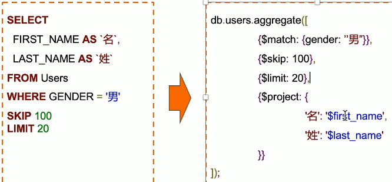


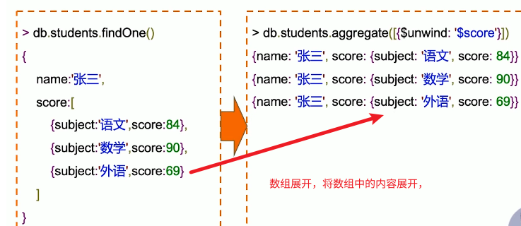

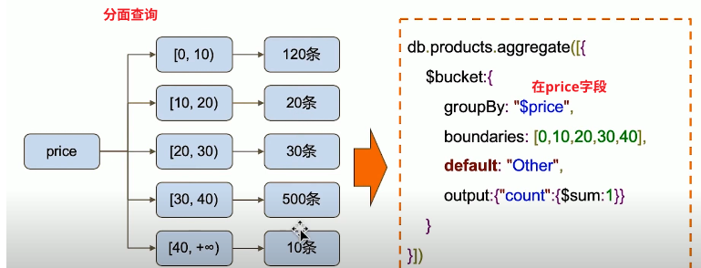

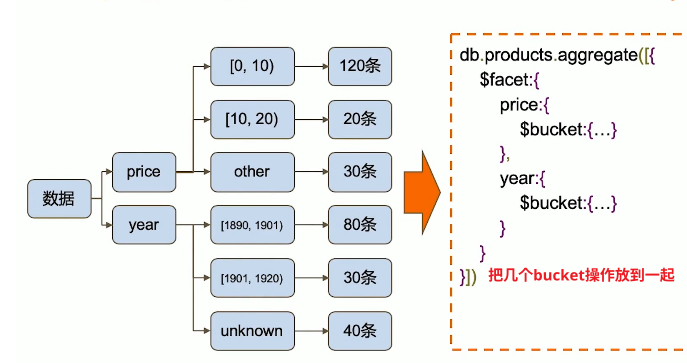

# 复制集

## 作用

mongodb复制集的主要意义在于实现服务高可用，它的现实依赖于两个方面的功能：

- 数据写入时数据迅速复制到另一个独立节点上
- 在接受写入的节点发生故障时自动选举出一个新的替代节点

在实现高可用的同时，复制集实现了其他几个附加作用：

- 数据分发：将数据从一个区域复制到另一个区域，减少另一个区域的读延迟
- 读写分离：不同类型的压力分别在不同的节点上执行
- 异地容灾：在数据中心故障时候快速切换到异地

## 典型复制集结构

一个典型的复制集由3个以上具有投票权的节点组成，包括：

- 一个注解点（PRIMARY）：接受写入操作和选举时投票
- 两个或多个从节点（SECONDARY）：复制主节点上的新数据和选举时投票（不能写入的）
- 不推荐使用Arbiter（投票节点），没有基数的情况下，很容易造成僵局


## 数据复制

- 一个修改操作到达主节点，记录成为oplog
- 从节点在主节点上打开一个tailable游标
- 从节点不断获取新进入的oplog，并在自己的数据上回放，以保持节点数据一致

## 故障恢复

- 具有投票权的节点之间两两互相发送心跳
- 5次心跳未收到时判定为失连
- 如果主节点失联，从节点发起选举，选出新的主节点
- 如果从节点失连，不会产生信的选举
- 选举基于RAFT一致性算法实现，选举成功的必要条件是大多数投票节点存活
- 复制集中最多可以有50个节点，但具有投票权的节点最多7个

**影响选举的因素：**

- 整个集群必须有大多数节点存活

  > 如果三个节点，必须两个或以上存活
  >
  > 如果五个节点，必须三个或以上存活
  >
  > 如果七个节点，必须四个或以上存活

- 被选举为主节点的节点必须：

  - 能够与多数节点建立连接
  - 具有较新的oplog（同等或更新）
  - 具有较高的优先级（如果有配置）

**常见选项：**

- 是否具有投票权（v参数）：有则参与投票

- 优先级（priority参数）：优先级越高的节点优先成为主节点，优先级为0的节点无法成为主节点

  > 用作数据备份

- 延迟（slaveDelay参数）：复制n秒之前的数据，保持与主节点的时间差

  > 用来防止误删数据，可以设置延迟12或者24小时，用于误删后恢复数据


**注意事项**:

- 因为正常的复制集可能成为主节点，他们的地位是一样，因此硬件配置必须一致

- 为了保证节点不会同时党纪，各节点使用的硬件必须具有独立性

- 复制集各节点软件版本必须一直，以免出现不可预知的问题

- 增加节点不会增加系统写性能

  > 读写分离可以分流读的性能，无法增加写的性能

## 集群配置

此处案例采用1物理机主节点，2docker容器副本节点

**启动mongodb:**

```bash
# 创建副本节点需要挂在的目录,不要放在个人home目录下，mongo启动的时候使用的是mongo用户
mkdir -p /opt/cluster/mongoone/data /opt/cluster/mongoone/config
mkdir -p /opt/cluster/mongotwo/data /opt/cluster/mongotwo/config

# 创建keyFIle
sudo openssl rand -base64 756 > /opt/cluster/mongodb-keyfile
cp /opt/cluster/mongodb-keyfile /opt/cluster/mongoone/config
cp /opt/cluster/mongodb-keyfile /opt/cluster/mongotwo/config


# 设置权限
sudo chmod 400 /opt/cluster/mongodb-keyfile
sudo chmod 400 /opt/cluster/mongoone/config/mongodb-keyfile
sudo chmod 400 /opt/cluster/mongotwo/config/mongodb-keyfile
# 999:999 是 mongodb 用户的 UID 和 GID
sudo chown mongodb:mongodb /opt/cluster/mongodb-keyfile
sudo chown 999:999 /opt/cluster/mongoone/config/mongodb-keyfile
sudo chown 999:999 /opt/cluster/mongotwo/config/mongodb-keyfile


# 修改配置文件
security:
  authorization: enabled
  keyFile: /opt/cluster/mongodb-keyfile
replication:
  replSetName: "rs0"
   
# 重启物理机节点
sudo systemctl restart mongod

# 复制配置文件
cp /etc/mongod.conf /opt/cluster/mongoone/config
cp /etc/mongod.conf /opt/cluster/mongotwo/config

# 编写docker-compose.yml文件
version: '3.8'
services:
  mongo1:
    image: mongo:latest
    container_name: mongo1
    network_mode: "host"
    volumes:
      - /opt/cluster/mongoone/data:/data/db
      - /opt/cluster/mongoone/config/mongod.conf:/etc/mongod.conf
      - /opt/cluster/mongoone/config/mongodb-keyfile:/etc/mongodb-keyfile
    environment:
      MONGO_INITDB_ROOT_USERNAME: admin
      MONGO_INITDB_ROOT_PASSWORD: password
    command: mongod --config /etc/mongod.conf --replSet rs0 --port 27018
    restart: unless-stopped

  mongo2:
    image: mongo:latest
    container_name: mongo2
    network_mode: "host"
    volumes:
      - /opt/cluster/mongotwo/data:/data/db
      - /opt/cluster/mongotwo/config/mongod.conf:/etc/mongod.conf
      - /opt/cluster/mongotwo/config/mongodb-keyfile:/etc/mongodb-keyfile
    environment:
      MONGO_INITDB_ROOT_USERNAME: admin
      MONGO_INITDB_ROOT_PASSWORD: password
    command: mongod --config /etc/mongod.conf --replSet rs0 --port 27019
    restart: unless-stopped

# 运行docker compose 
sudo docker compose up -d

# 检查运行情况
sudo docker ps -a

# 测试启动单节点（测试用）
sudo docker run -d \
  -p 27018:27017 \
  -v /opt/cluster/mongoone/data:/data/db \
  -v /opt/cluster/mongoone/config/mongod.conf:/etc/mongod.conf \
  -v /opt/cluster/mongoone/config/mongodb-keyfile:/etc/mongodb-keyfile  \
  mongo:latest \
  mongod --config /etc/mongod.conf

sudo docker run -d \
  -p 27019:27017 \
  -v /opt/cluster/mongotwo/data:/data/db \
  -v /opt/cluster/mongotwo/config/mongod.conf:/etc/mongod.conf \
  -v /opt/cluster/mongotwo/config/mongodb-keyfile:/etc/mongodb-keyfile \
  mongo:latest \
  mongod --config /etc/mongod.conf
```

**配置复制集：**

- 方法1：此方式hostname需要能被解析

  ```bash
  
  # 确认是否可以解析
  hostname -f
  # 进入mongosh
  mongosh --port 27017 -u "username" -p "password" --authenticationDatabase "admin"
  mongosh --port 27018 -u "admin" -p "password" --authenticationDatabase "admin"
  
  rs.initiate()
  # rs.add("HOSTNAME:PORT")
  rs.add("localhost:27018")
  rs.add("localhost:27019")
  ```

  

- 方法2：

```bash
# 进入mongosh
mongosh --port 27017 -u "username" -p "password" --authenticationDatabase "admin"

# 配置复制集
rs.initiate({
	_id:"rs0",
	members:[{
	_id:0,
	host:"192.168.1.7:27017"
	},{
	_id:1,
	host:"192.168.1.7:27018"
	},{
	_id:2,
	host:"192.168.1.7:27019"
	}]
})
```

**允许从节点读**:

```bash
rs.slaveOk()
```

**注意事项:**

- 所有的写操作默认只能在主节点上进行
- 只允许主节点接受写操作以保证数据的一致性
- 默认情况在主节点上进行读取，可以确保读取到最新的数据
- 可以配置从从节点读取数据
- 主节点故障，会自动选举一个新节点，过程中短暂无法写入

# 事物

## 写操作

### writeConcern

决定一个写操作落到多少个节点才算成功：

- 0：发起写操作，不关心是否成功
- 1~n：写操作需要被复制到制定节点数才算成功
- majority：写操作需要被复制到大多数节点才算成功

> 发起写操作的程序将阻塞到写操作到达制定的节点数为止


### journal

定义如何才算成功

- true：写操作落到journal文件中才算成功
- false：写操作达到内存即算作成功

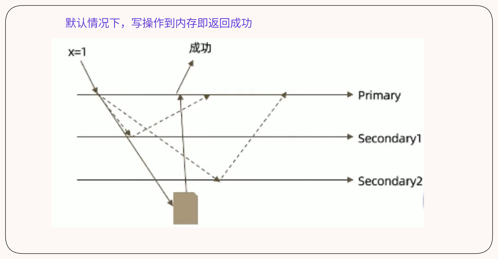

## 读操作

数据读取需要关注两个问题：

1. 从哪里读，关注数据节点位置
2. 什么样的数据可以读，关注数据隔离行

### readPerference

决定使用哪一个节点来满足正在发起的读取请求：

- primary：只选择主节点
- primaryPreferred：优先主节点，不可用则选择从节点
- secondary：只选择从节点
- secondaryPreferred：优先选择从节点，如果从节点不可用则选择主节点
- nearest：选择最近的节点

**举例**:

- 用户下订单后马上将用户转到订单详情页：primary/primaryPreferred，从节点kenned还没复制到新订单
- 用户查询自己下过的订单：secondary/secondayPreferred：历史订单记录对时效性要求不高
- 生成报表：secondary，报表对时效性要求不高，资源需求大，可以在从节点单独处理，避免对线上用户造成影响
- 将用户上传的图片分发到全世界，用户就近读取：nearest：选择就近节点读取

**readPreference与Tag**:

readPreference只能控制使用一类节点，Tag则可以将节点选择控制到一个或几个，考虑一下场景：

- 一个5节点的复制集
- 3个节点硬件较好，专用于服务线上客户
- 2个节点硬件较差，专用于生成报表

通过Tag实现控制目的

- 3个好节点打上`{purpose:"online"}`标签
- 2个差节点打上`{purpose:"analyse"}`标签
- 在线应用读取时制定online，报表读取制定reporting

**配置方式：**

- 通过连接串参数配置：`mongodb://host1:port,host2:port,host3:port/?replicaSet=rs0&readPreference=secondary`
- 通过驱动程序API：`MongoCollection.withReadPreference(ReadPreference readPref)`
- Mongo Shell：`db.collection.find({}).readPref("secondary")`

**注意事项：**

- 制定readPreference时也应注意高可用问题：

  > 指定primary时，发生故障转移期间没有节点可读，业务允许应使用primaryPreferred

- 使用Tag也会有同样的问题：

  > 如果一个节点拥有一个特定的tag，则该节点失效将无节点可读

- Tag有时需要与优先级、选举权综合考虑

  > 不希望升级为主节点，则应设置优先级为0

### readConcern

readConcern决定节点上哪些数据可读，类似与关系型数据库的隔离级别

- available：读取所有可用的数据
- local：读取所有可用且属于当前分片的数据
- majority：读取在大作数节点上提交完成的数据
- linearizable：可线性化读取文档
- snapshot：读取最近快照中的数据

**local与available：**

复制集中local和available没有区别，一个chunk x shard1向shard2迁移，迁移过程中chunk x部分数据会在shard1和shard2同时存在，但源分片人然是chunk x的负责方


- 所有对chunk x的读写操作依然进入shard1
- config中记录的信息chunk x 依然属于shard1

此时读取shard2，则会出现local和available的区别：

- local：只取应该有shard2负责的数据（不包括x）
- available：shard2上有什么就读什么（包括x）

> - 看上去总应该选择local，但对结果集过滤会造成额外消耗，无关紧要场景可以选择available
> - 3.6版本以后不支持从节点使用readConcern为local
> - 从节点读取数据时默认是local，从从节点读取数据时默认是available（向前兼容原因）

**majority:**

读取大多数数据节点上都提交了的数据


应用需要在t5时刻才能读取到更新后的数据，考虑t3时刻的Seconday1,此时：

- 对于要求majority的读操作，他将返回x=0
- 对于不要求majority的读操作，他将返回x=1

**实现原理:**

- 节点上维护多个x版本，MVCC机制，通过维护多个快照来链接不同的版本：
- 每个被大多数节点确认过的版本都将是一个快照
- 快照持续到没有使用为止才被删除

**mongodb中的回滚:**

- 写操作到达大多数节点之前都是不安全的，一旦主节点崩溃，而从节点还没复制到该次操作，刚才的写操作就丢失了
- 把一次写操作视为一个事物，从事物的角度，可以认为事物被混滚了

从分布式系统的角度来看，事物的提交被提升到了分布式集群的多个节点级别的提交，而不再单个节点的体积哦啊

在可能发生回滚的前提下考虑脏读问题

- 如果一次写操作到达大多数节点前读取了gheg写操作，然后因为系统故障回滚了，则发生了脏读问题
- 使用{readConcern:"majority"}可以有效避免脏读

**readConcern如何实现安全的读写分离：**

场景：向主节点写入一条数据，立即从从节点读取这条数据

- 使用一下方式可能独步到刚写入的订单

  

- 使用writeConcern+readConcern mahority解决

  

- readConcern主要关注读的隔离性，ACID中的Isolation
- readConcern相当于关系型数据库的read committed（读已提交）隔离级别

**linearizable：**

只读取大多数节点确认过的数据，和majority最大差别是保证绝对的操作线性顺序，在写操作自然事件后面的发生的读，一定可以读到之前的写数据：

- 只对读取单个文档时有效
- 可能导致非常慢的读，因此总是建议配合maxTimeMS

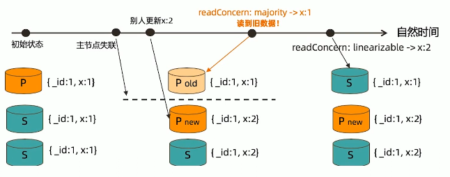

**snapsho:**

只在多文档事物中生效，将一个事物的readConcern设置为snapshot，将保证在事物中的读：

- 不出现脏读
- 不出现不可重复读
- 不出幻读

因为所有的读都将使用同一个快照，知道事物提交为止，该快照才被释放

## 多文档事物

4.2开始全面支持多文档事物，但不代表可以无节制使用，通过合理的设计文档模型，可以规避绝大部分使用事物的必要性，事物=锁，节点协调，额外开销，性能影响

**mongodb ACID的支持:**

- Atomocity：原子性
  - 单表单文档：1.x就支持，
  - 复制集多表多行：4.0复制集
  - 分片集群多表多行：4.2
- Consistency：一致性
  - writeConcern
  - readConcern(3.2)
- Isolation：隔离性
  - readConcern（3.2）
- Durability：持久性
  - journal and replication

**事物隔离级别**：

- 事物完成前，事物外的操作对该事物所做的修改不可访问
- 如果事物内使用{readConcern:"snapshot"}，则可以达到可重复读，repeatable read

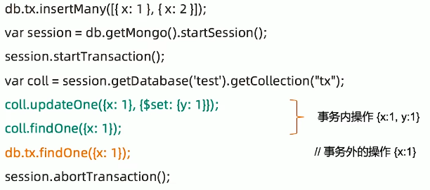


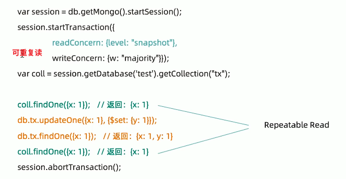

**事物写机制:**

mongodb的事物错误处理机制不同于关系数据库

- 当一个事物开始后，如果事物要修改的文档在事物外部被修改过，则事物修改这个文档会出发Abort错误，因为此时的修改冲突了
- 这种情况，只需要简单的重做事物就可以了
- 如果一个事物已经开始修改一个文档，在事物以外尝试修改同一个文档，则事物以外的修改会等待事物完成才能继续

**注意事项:**

- 可以实现和关系型数据库类似的事物场景
- 必须使用mongodb4.2兼容的驱动
- 事物默认必须在60（可调整）内完成，否则将被取消
- 设计师无的分片不能使用仲裁节点
- 事物会影响chunk迁移效率，正在迁移的chunk也可能造成事物提交失败（重试即可）
- 多文档事物中的读操作必须使用主节点读
- readConcern只应该在事物级别设置，不能设置在每次读写操作上

## Change Stream

change Stream 是mongodb用于实现变更追踪的解决方案，类似于关系数据库的触发器，但原理不完全相同


**实现原理：**

change strean 是基于oplog实现的，在oplog上开启一个tailable cursor来追踪所有复制集上的变更操作，最终调用应用中定义的回调函数。被追踪的变更事件主要包括：

- insert/update/delete：插入、更新、删除
- drop：集合被删除
- rename：集合被重命名
- dropDatabase：数据库被删除
- invaliate：drop/rename/dropDatabase将导致invalidate被触发，并关闭change stream

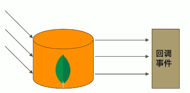

**change strean 与可重复读：**

值推送已经在大多数节点上提交的变更操作，即可重复读的变更，这个验证是通过readConcern：majority实现的，因此：

- 未开启majority readConcern的集群无法使用change Stream
- 集群无法满足w：majority时，不会出发change stream（例如PSA架构中S因故宕机）

**变更过滤：**

如果只对某些类型的变更事件感兴趣，可以使用聚合管道的过滤步骤过滤事件：


**示例：**


**故障恢复：**


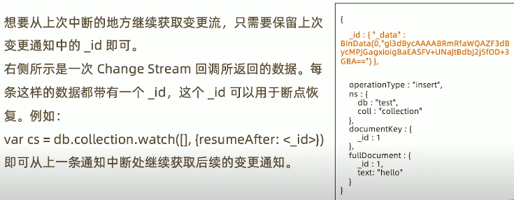

**使用场景：**

- 跨集群的变更复制：在源集群中订阅Change Stream
- 微服务联动：一个微服务变更数据库时，其他微服务得到通知并作出相应的变更
- 其他任何需要系统联动的场景

**注意事项:**

- change steram 依赖于oplog，因此终端事件不可超过oplog回收的最大时间窗
- 执行update时，如果只更新了部分数据，change stream 通知的也是增量部分
- 同理，删除数据时通知的仅是删除的数据的_id
