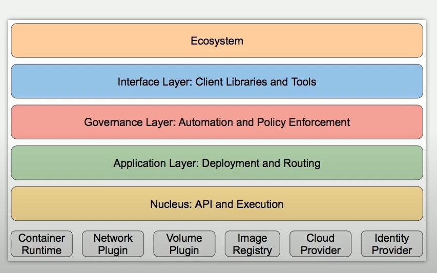
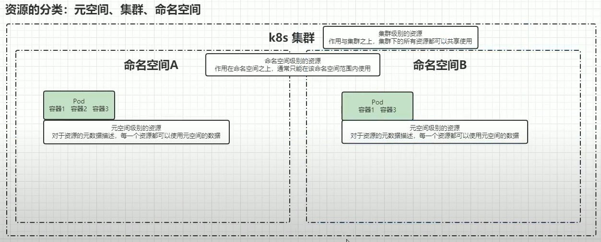
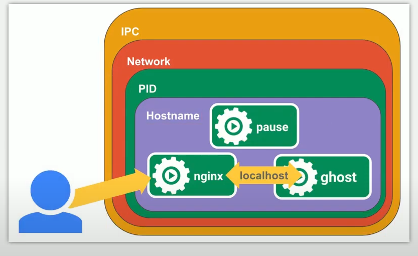
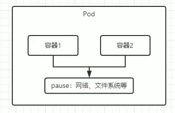
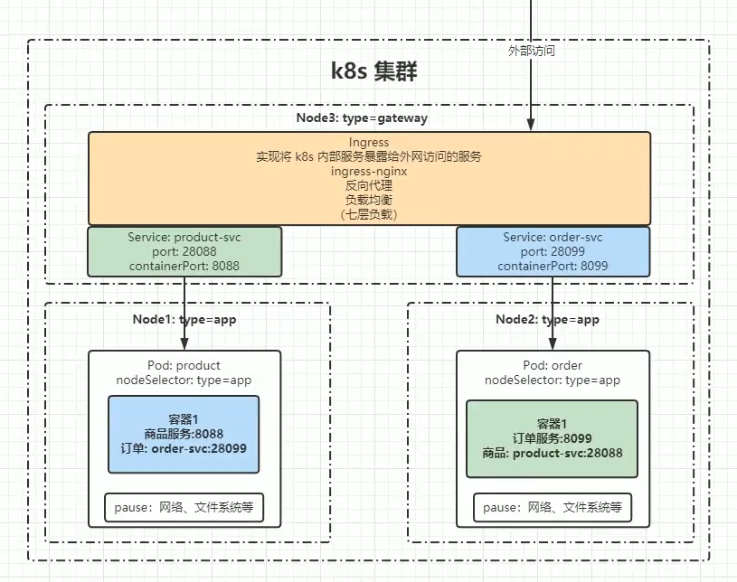
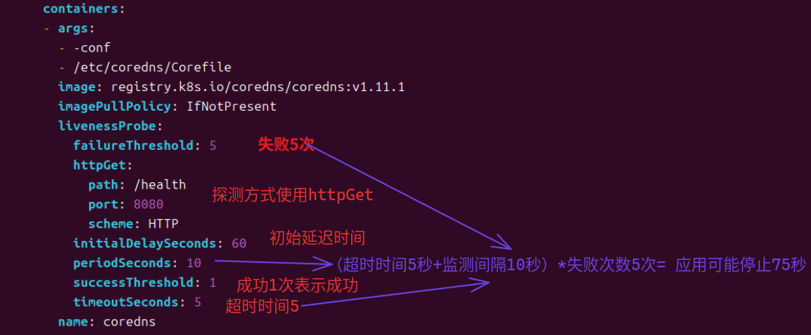
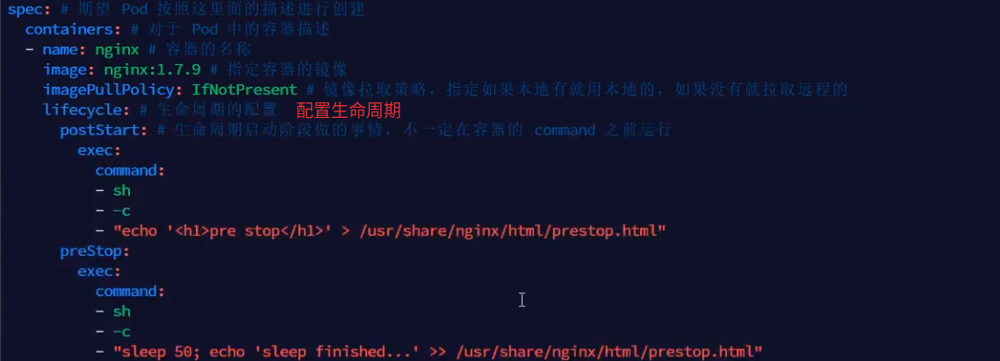

# 简介

## 组件


### master


- api-server：接口服务，基于REST风格开放k8s接口的服务
- kube-controller-manager：控制器管理器，管理各个类型的控制器，针对k8s中的各种资源进行管理
- cloud-controller-manager：云控制器管理器，第三方平台提供的控制器API对接管理功能
- kube-scheduler：调度器，负责将Pod基于一定算法，将其调用到更合适的节点（服务器）上
- etcd：理解为k8s的数据库，键值类型存储的分布式数据库，提供了基于Raft算法实现自主的集群高可用
  - 老版本：基于内存
  - 新版本：持久话存储

### node


- kubelet：负责Pod的生命周期、存储、网络（container runtime interface）
- kube-proxy：网络代理，负责Service的服务发现、负载均衡（4层负载）
- Pod：一个Pod中最少需要有1个容器
- container-runtime：容器运行时环境，docker、containerd、CRI-O（container runtime interface）

### 附加组件

- kube-dns：域名管理
- ingress Controller：外部服务访问控制器
- Heapster/Prometheus：提供资源监控
- Dashboard：提供GUI界面
- Federation：提供跨可用取的集群
- Fluentd-elasticsearch：日志搜索

**分层架构:**



- 生态系统：构建的K8s生态系统，如GUI等
- 接口层：所有生态系统都需要调用k8s的接口层
- 管理层：系统度量（如基础设施，容器和网络的度量）、自动化（如自动扩展、动态Provision等）以及策略管理（RBAC、Quota、PSP、NetworkPOlicy等）
- 应用层：部署（无状态应用、有状态应用、批处理任务、集群应用等）和路由（服务发现、DNS解析等）
- 核心层：最核心的功能，对外提供API构建高层的应用，对内提供插件式应用的执行环境

## 服务的分类

- 无状态应用：不会对本地环境产生依赖，如不会存储数据到本地磁盘
  - 优点：对客户端透明，无依赖关系，可以高校实现扩容、迁移
  - 缺点：不能存放数据，需要额外的数据服务支撑
- 有状态应用：会对本地环境产生依赖，如会存储数据到本地磁盘
  - 优点：可以独立存储数据，实现数据管理
  - 缺点：集群环境下需要实现主从、数据同步、备份、水平扩容复杂

## 资源和对象

k8s中所有内容都被抽象为"资源"，如Pod、Service、NOde等都是资源。"对象"就是资源的示例，是持久化的实体。

如某个具体的POd、某个具体的Node，kubernetes使用这些实体去表示整个集群的状态。

对象的创建、删除、修改是通过kubernetes API，也就是API server组件提供的API接口，这些是RESTful风格的Api，与k8s万物接对象理念相符。命令行工具kubectl实际上也是调用kubernetes api

k8s中的资源类别有很多种，kubectl可以通过配置文件来创建

规约：spec是规约、规格的意思，spec是必须的，他描述了对象的期望状态----希望对向所具有的特征。当创建kubernetes对象时，必须提供对象的规约，用来描述该对象的期望状态，以及关于对象的一些基本信息

状态：表示对象的实际状态，该属性由k8s自己维护，k8s会通过一系列的控制器对对应对象进行管理，让对象尽可能的让实际状态与期望状态重合。

资源清单：


## 资源的分类



### 元数据类型

对于资源的元数据的描述，每一个资源都可以使用元数据的数据：

- Horizontal Pod Autoscaler（HPA）：Pod自动扩容

  > 控制器每隔30s（可以通过horizontal-pod-autoscaler-sync-period修改）查询metrics的资源使用情况
  >
  > 支持三种metrics类型
  >
  > - 预定义metrics（比如Pod的CPU）以利用率的方式计算
  > - 自定义Pod metrics，以原始值（raw value）的方式计算
  > - 自定义object metrics
  >
  > 支持两种metrics查询方式：Heapster和自定义REST API
  >
  > 支持多metrics

- PodTemplate：关于Pod的定义，但是背包汗在其他的kubernetes对象中（如Deployment、StatefulSet、DaemonSet等控制器）‘控制器通过Pod Template信息来创建Pod

- LimitRange：对器群内的Request和LImits的配置做一个全局的统一的限制，相当于批量设置了某一个范围内（某个命名空间）的Pod的资源使用限制。

### 集群级

作用于集群之上，集群下的所有资源都可以共享使用

- Namespace
- Node：不像其他的资源，Node本质上不是kubernetes来创建的，kuberneter只是管理Node上的资源。虽然可以通过Mainfest创建一个NOde对象，但kubernetes也只是取检查是否真的是有这么一个Node，如果检查时白，也不会往上调度Pod
- ClusterRole：集群角色管理
- ClusterRoleBinding：角色与资源进行绑定，只能往集群资源级别上进行绑定

### 命名空间级

#### 工作负载型

作用在命名空间上，通常只能在该命名空间内使用

**Pod：**kubernetes中最小的可部署单元。

一个Pod(容器组)包含了一个应用程序容器（某些情况下是多个容器）、存储资源、一个唯一的网络IP地址、以及一些确定容器该如何运行的选项。Pod容器组代表了kubernetes中的一个独立的应用程序运行实例，该示例可能有单个容器或者几个紧耦合在一起的容器组成

docker是kubernetes Pod中使用最广泛的容器引擎kubernetes Pod同时也支持其他类型的容器引擎。



一个pod可以被复制成多份，每一份可被称之为一个副本，这些副本除了一些描述的信息（pod名字、uid等）不一样外，其他信息都是一样的。


**控制器：**pod的控制器通常包含一个名为replicas的属性。replicas属性则指定了特定Pod的副本的数量，当当前集群中该pod的数量与该属性制定的值不一致时，k8s会采取一些策略取使得当前状态满足配置的要求

适用无状态服务：ReplicationController(RC)、ReplicaSet(RS)、Deployment。

> RC主要的作用就是用来保持容器应用的副本数始终保持在用户定义的副本数，如果有容器异常退出，会自动创建新的Pod来替代quechua的容器也会自动挥手，v1.11版本废弃
>
> kubernetes建议使用RS替代RC进行部署，RS跟RC没有本质的不同，只是名字不一样，并且RS支持集合是的selector，可以通过selector来选择对哪些Pod生效
>
> deployment针对RS的更高层次的封装，提供了更丰富的部署相关的功能：
>
> - 自动创建Replica Set/Pod
> - 滚动升级/回滚
> - 平滑扩容和缩容
> - 暂停和恢复

适用有状态服务：StatefulSet


> 稳定的持久存储、稳定的网络标识、有序部署、有序或栈、有序收缩、有序删除

- headless service：用于定义网络标识（DNS domain） domain name service。pod name-->访问路径（域名）自动绑定到ip上

  

- volumeClaimTemplate：

守护进程：Daemon

> 保证每个Node上都运行一个容器副本，常用来部署一些集群的日志、监控或者其他系统管理应用。
>
> - 日志收集，比如fluentd，logstash
> - 系统键桶，比如Prometheus Node Exporter，collectd，New Relic agent，Ganglia gmond等
> - 系统程序：比如kube-proxy，kube-dns，glusterd，ceph等


任务/定时任务：Job、CronJob

> Job：一次性任务，运行玩就销毁
>
> CronJob：周期性执行的任务

#### 服务发现

service：集群内网络通信，跨节点通信，负载均衡（四层负载）

ingress：实现k8s内部服务暴露给外网访问的服务




#### 配置与存储

volume：数据卷，共享Pod中容器使用的数据，用来持久化的数据，比如数据库数据

CSI：container server interface，将任意存储系统暴露给容器化应用的程序

#### 特殊类型配置

- ConfigMap：key、value类型的配置，可以将配置加载到pod中，可以将pod中的配置暴露出来，方便修改
- Secret：与ConfigMap作用相同，加密了
- DownwardAPI：提供了两种方式用于将pod信息注入到容器内，环境变量、volume挂载

#### 其他

Role：定义一组权限

RoleBinding：角色绑定

## 安装

### 环境准备

```bash
# node节点安装依赖
sudo apt update
sudo apt install openssh-server
sudo systemctl status ssh

# 生成ssh密钥，默认路径/home/hsiangya/.ssh/id_rsa  # 将密钥传递node节点
ssh-keygen -t rsa -b 4096
ssh-copy-id -i ~/.ssh/id_rsa.pub hsiangya@192.168.1.101

# 每台机器都关闭空间交换
sudo swapoff -a

# 关闭SElinux
sudo apt-get install policycoreutils
sudo setenforce 0
sudo setenforce 1
sestatus
sudo  # 永久关闭
SELINUX=disabled

# 关闭swap，找到包含swap的行 注释掉
sudo vim /etc/fstab

# 设置主机名
sudo hostnamectl set-hostname <hostname>
# 在master 添加hosts
sudo cat >> /etc/hosts <<EOF
192.168.1.7 master
192.168.1.101 node1
192.168.1.102 node2
192.168.1.104 node4
EOF

sudo cat >> /etc/hosts <<EOF
116.198.217.180 master
EOF


# 时间同步1. 
sudo apt-get update
sudo apt-get install ntpdate
sudo ntpdate time.windows.com
# 同步时间2. 阿里云
sudo apt install ntp
sudo vim /etc/ntp.conf
server ntp1.aliyun.com iburst
server ntp2.aliyun.com iburst
server ntp3.aliyun.com iburst
server ntp4.aliyun.com iburst
sudo systemctl enable ntp
sudo systemctl start ntp
ntpdate -u ntp1.aliyun.com
```

### 防火墙端口

```bash
# 开放主节点端口
sudo ufw allow 6443
sudo ufw allow 2379:2380/tcp
sudo ufw allow 10250
sudo ufw allow 10251
sudo ufw allow 10252
sudo ufw reload

# 开放工作节点端口
sudo ufw allow 10250

# 如果使用 NodePort 范围
sudo ufw allow 30000:32767/tcp
sudo ufw allow 30000:32767/udp

# 应用设置
sudo ufw enable
```

### containerd

https://github.com/containerd/containerd/blob/main/docs/getting-started.md

```bash
# 下载并解压到/usr/local
sudo wget https://github.com/containerd/containerd/releases/download/v1.7.18/containerd-1.7.18-linux-amd64.tar.gz
sudo tar Cxzvf /usr/local containerd-1.7.18-linux-amd64.tar.gz

# 下载自动启动脚本到指定位置
sudo curl https://raw.githubusercontent.com/containerd/containerd/main/containerd.service -o /etc/systemd/system/containerd.service
# 修改sandbox image
sudo containerd config default > /etc/containerd/config.toml
sudo sed -i 's#sandbox_image = "registry.k8s.io/pause:3.8"#sandbox_image = "registry.aliyuncs.com/google_containerd/pause"#g' /etc/containerd/config.toml
sudo systemctl daemon-reload
sudo systemctl enable containerd.service
sudo systemctl start containerd.service
sudo systemctl status containerd.service
containerd --version

# 安装runc
sudo wget https://github.com/opencontainers/runc/releases/download/v1.1.13/libseccomp-2.5.5.tar.gz
sudo tar xf libseccomp-2.5.5.tar.gz
cd libseccomp-2.5.5
sudo apt install gperf -y
./configure
make && make install
find / -name "libseccomp.so"
sudo wget https://github.com/opencontainers/runc/releases/download/v1.1.13/runc.amd64
sudo install -m 755 runc.amd64 /usr/local/sbin/runc
runc --version

# 安装CNI插件
sudo wget https://github.com/containernetworking/plugins/releases/download/v1.5.0/cni-plugins-linux-amd64-v1.5.0.tgz
sudo mkdir -p /opt/cni/bin
sudo tar Cxzvf /opt/cni/bin cni-plugins-linux-amd64-v1.5.0.tgz
ls /opt/cni/bin
```

### 先决条件

> 官方文档 目前未知影响

```bash
cat <<EOF | sudo tee /etc/modules-load.d/k8s.conf
overlay
br_netfilter
EOF

sudo modprobe overlay
sudo modprobe br_netfilter

# sysctl params required by setup, params persist across reboots
cat <<EOF | sudo tee /etc/sysctl.d/k8s.conf
net.bridge.bridge-nf-call-iptables  = 1
net.bridge.bridge-nf-call-ip6tables = 1
net.ipv4.ip_forward                 = 1
vm.swappiness = 0
EOF

# Apply sysctl params without reboot
sudo sysctl --system

lsmod | grep br_netfilter
lsmod | grep overlay

sysctl net.bridge.bridge-nf-call-iptables net.bridge.bridge-nf-call-ip6tables net.ipv4.ip_forward

# 配置systemdcgroup 驱动程序
sudo vim /etc/containerd/config.toml

[plugins."io.containerd.grpc.v1.cri".containerd.runtimes.runc]
  ...
  [plugins."io.containerd.grpc.v1.cri".containerd.runtimes.runc.options]
    SystemdCgroup = true
```


### kubeadm、kubelet、kubectl

```bash
sudo apt-get update
sudo apt-get install -y apt-transport-https ca-certificates curl gpg
# sudo mkdir -p -m 755 /etc/apt/keyrings
curl -fsSL https://pkgs.k8s.io/core:/stable:/v1.29/deb/Release.key | sudo gpg --dearmor -o /etc/apt/keyrings/kubernetes-apt-keyring.gpg
echo 'deb [signed-by=/etc/apt/keyrings/kubernetes-apt-keyring.gpg] https://pkgs.k8s.io/core:/stable:/v1.29/deb/ /' | sudo tee /etc/apt/sources.list.d/kubernetes.list
sudo apt-get update
sudo apt-get install -y kubelet kubeadm kubectl
sudo apt-mark hold kubelet kubeadm kubectl
systemctl enable kubelet
```

### 构建集群

```bash
# 查看镜像,并提前拉取
kubeadm config images list
kubeadm config images pull

sudo kubeadm init \
--apiserver-advertise-address=192.168.1.7 \
--kubernetes-version v1.29.3 \
--service-cidr=10.96.0.0/12 \
--pod-network-cidr=192.168.0.0/16 

# 根据输出信息执行对应指令
sudo mkdir -p $HOME/.kube
sudo cp -i /etc/kubernetes/admin.conf $HOME/.kube/config
sudo chown $(id -u):$(id -g) $HOME/.kube/config

```

### 网络插件

https://kubernetes.io/docs/concepts/cluster-administration/addons/

```bash
# 安装
kubectl create -f https://raw.githubusercontent.com/projectcalico/calico/v3.28.0/manifests/tigera-operator.yaml
kubectl create -f https://raw.githubusercontent.com/projectcalico/calico/v3.28.0/manifests/custom-resources.yaml
watch kubectl get pods -n calico-system

# 安装完成后查看节点状态
kubectl get node -o wide
```

## kubectl命令

- 从节点本质是通过访问API server来控制，`~/.kube/config`中保留了配置文件

- 在任意节点使用kubectl：

  - 将master节点中 `/etc/kubernetes/admin.conf`拷贝到需要运行的服务器的`/etc/kubernetes`目录中
  - 在对应的服务器上配置环境变量：`echo “export KUBECONFIG=/etc/kubernetes/admin.conf" >> ~/.bash_profile`,然后激活环境`source ~/.bash_profile`

  **命令：**

  - create：创建某个资源
  - get：获取某个资源的信息
  - run：运行一个资源
  - expose：暴露资源的信息
  - delete：删除资源

  - apply：应用或更新资源配置
  - annotate：资源添加或修改注释，注释是用于存储额外信息的键值对
  - autoscale：设置自动扩缩容规则
  - debug：提供一种方式来调试集群中的容器
  - diff：显示本地配置文件与集群当前状态之间的差异
  - edit：直接编辑kubernetes集群中的资源配置
  - kustomize：使用kustomize管理kubernetes资源的工具
  - label：添加或修改kubernetes资源的标签
  - patch：对kubernetes资源进行部分更新
  - replace：替换资源的当前规格
  - rollout：管理资源的部署过程，如回滚之前版本或查看部署状态
  - scale：手动调整服务或部署的副本数量，增减Pod数量
  - set：修改特定资源的特定配置，如环境变量或容器的镜像
  - wait：等待特定的kubernetes资源达到某个状态

  **资源别名：**

  pods：pod

  deployments：deploy

  services：svc

  namespace：ns

  nodes：no

```bash
kubectl get no # 获取节点信息
kubectl get pod # 获取pod信息类表
kubectl get ns # 获取命名空间
kubectl get deploy 
```

## API概述

类型：

- Alpha：默认情况会禁用，可能有bug，尝鲜
- Beta：做过完善的测试，基本上没问题，不会被删除，命名方式`v2beta3`
- Stable：主要使用的版本，稳定版,命名方式`vX`

访问控制：

- 认证： 
- 授权：

# Pod

```bash
# 获取pod信息
kubectl get pods
kubectl get deploy
kubectl delete deloy <name> # 删除
kubectl get services # 获取services信息
kubectk delete svc <name>
```

## 配置文件启动

- 编写配置文件：[官方示例](https://kubernetes.io/docs/concepts/configuration/manage-resources-containers/)


简易示例：

```yaml
apiVersion: v1 # 支持的wending版本
kind: Pod # 资源对象类型
metadata:
  name: nginx-demo # pod名称
  labels: # 定义标签
    typeasdasd: app # 这里可以随便写 键值形式就行
    type: app # 名字为type，值为app，自定义的label
    version: 1.1.0
  namespace: 'default' # 没写默认default
spec: # 期望Pod按照这里面的描述进行创建
  containers: # 地哦与pod中的容器描述
  - name: nginx
    image: nginx:1.7.9 # 制定镜像名称以及版本
    imagePullPolicy: IfNotPresent  # 镜像的拉取策略
    command: # 容器启动时执行的命令
    - nginx
    - -g
    - 'daemon off;' # nginx -g "daemon off" 形式执行
    workingDir: /usr/ # 程序启动目录
    ports: 
    - name: http # 端口名称
      containerPort: 80 # 容器内暴露的端口
      protocol: TCP # 描述暴露信息基于的通信协议
    env: # 环境变量名称 
    - name: JVM_OPTS
      value: "-Xms128m -Xmx128m"
      
    resources:
      requests: # 最少需要多少资源
        cpu: 100m # 限制CPU最少使用0.1核心 1000m等于一个核心
        memory: 128Mi # 限制内存最少使用128M
      limits: # 最多可以使用多少资源
        cpu: 200m # 最多使用0.2个核心
        memory: 256Mi # 最大的内存使用
restartPolicy: OnFailure # 重启策略，只有失败才会重启    
  
```

1. 执行：`kubectl create -f nginx-demo.yaml`
2. 查看描述信息：`kubectl describe po nginx-demo`
3. 查看pod信息：`kubectl get po -o wide`

| 参数名                                      | 类型    | 字段说明                                                     |
| ------------------------------------------- | ------- | ------------------------------------------------------------ |
| apiVersion                                  | String  | k8s版本说明，可以使用kubectl api version查看                 |
| kind                                        | String  | yaml文件定义的资源类型和角色                                 |
| metadata                                    | Object  | 元数据对象，下面是他的属性                                   |
| metadata.name                               | String  | 元数据对象的名字，比如Pod的名字                              |
| metadata.namespace                          | String  | 元数据对象的命名空间                                         |
| Spec                                        | Object  | 详细定义对象                                                 |
| Spec.containers[]                           | list    | 定义Spec对象的容器列表                                       |
| Spec.containers[].name                      | String  | 为列表中的某个容器定义名称                                   |
| Spec.containers[].image                     |         | 为列表中的某个容器定义需要的镜像名称                         |
| Spec.containers[].imagePullPolicy           | string  | 定义镜像拉取策略：<br />-  Always：默认，每次都尝试重新拉取镜像<br />- Never：表示近视用本地镜像<br />- IfNotPresent：本地有镜像，使用本地镜像，没有就在线拉取 |
| Spec.containers[].command[]                 | list    | 指定容器启动命令，数组，可以指定多个，不指定则使用镜像打包时的启动命令 |
| Spec.containers[].args[]                    | list    | 指定容器启动命令参数，数组，可以指定多个                     |
| Spec.containers[].workingDIr                | string  | 指定容器的工作目录                                           |
| Spec.containers[].volumeMounts[].           | list    | 指定容器内部的存储卷配置                                     |
| Spec.containers[].volumeMounts[].name       | string  | 指定可以被容器挂在的存储卷的名称                             |
| Spec.containers[].volumeMounts[].mountPath  | string  | 指定可以被容器挂在的存储卷路径                               |
| Spec.containers[].volumeMounts[].readOnly   | string  | 设置存储卷路径的读写模式，true或false，默认是读写模式        |
| Spec.containers[].ports[]                   | list    | 指定容器需要用到的端口列表                                   |
| Spec.containers[].ports[].name              | string  | 指定端口的名称                                               |
| Spec.containers[].ports[].containerPort     | string  | 指定容器需要监听的端口号                                     |
| Spec.containers[].ports[].hostPort          | string  | 指定容器所在主机需要监听的端口号，默认与containerPort相同    |
| Spec.containers[].ports[].protocol          | string  | 指定端口协议，支持TCP和UDP，默认TCP                          |
| Spec.containers[].env[]                     | list    | 指定容器运行前需要设置的环境变量列表                         |
| Spec.containers[].env[].name                | string  | 指定环境变量名称                                             |
| Spec.containers[].env[].value               | string  | 指定环境变量值                                               |
| Spec.containers[].resources                 | Object  | 指定资源限制和资源请求的值                                   |
| Spec.containers[].resources.limits          | Object  | 指定设置容器运行时资源的运行上限                             |
| Spec.containers[].resources.limits.cpu      | string  | 指定CPU的限制，单位为Core数                                  |
| Spec.containers[].resources.limits.memory   | string  | 指定mem内存的限制，单位为MIB、GIB                            |
| Spec.containers[].resources.requests        | Object  | 指定容器启动和调度时的限制设置                               |
| Spec.containers[].resources.requests.cpu    | string  | CPU请求，单位为core数，容器初始化可用数量                    |
| Spec.containers[].resources.requests.memory | string  | 内存请求，单位为MIB、GIB，容器启动的初始化可用数量           |
| sepc.restartPolicy                          | string  | 定义pod的重启策略：<br />- Always：pod一旦终止运行，无论容器何时终止，都会重启，默认<br />- OnFailure：只有pod以非0退出码终止时，kubelet才会重启该容器，正常结束不会重启<br />- Never：pod终止后，kubelet将退出码报告给master，不会重启pod |
| spec.nodeSelector                           | Object  | 定义NOde的label过滤标签，以k：v格式指定                      |
| spec.imagePullSecrets                       | Object  | 定义pull镜像时使用secret名称，以name:secretkey格式指定       |
| spec.hostNetwork                            | Boolean | 定义是否使用主机网络模式，默认false，设置true表示使用宿主机网络，不使用网桥 |

## 探针

容器内应用的检测机制，根据不同的探针来判断容器应用的状态

**类型：**

- StartupProbe：用于判断应用程序是否已经启动了，当设置startupProbe后，会先禁用其他探针，知道startupProbe成功后，其他探针才会继续。

  > 有时候不能预估应用多长时间启动，确保应用启动后，才执行另外两种探针

- LivenessProbe：用于检测探测容器中的应用是否运行，如果探测失败，kubelet会根据配置的重启策略进行重启，若没有配置，默认为容器启动成功，不会制定重启策略

  > 用于重启pod

- ReadinessProbe：用于探测容器内的程序是否健康，它的返回值如果返回success，那么就认为该容器已经完全启动，并且该容器是可以接受外部流量的

  > 用于检测是否健康

**探测方式：**：

- ExecAction：在容器内部执行一个命令，如果返回值为0,则任务容器时健康的
- TCPSocketAction：通过tcp连接检测容器内端口是否开放，如果开放则证明该容器健康
- HTTPGetAction：配置成一个http请求，如果返回的状态吗在200-400之间，则认为容器健康

**参数配置：**

- initialDelaySeconds：初始化时间

  > 无法完全替代staratup探针，因为无法确保一个程序启动的确定时间

- timeoutSeconds：超时时间

- periodSeconds：监测间隔时间

- successThreshold：检查几次成功就表示成功

- failureThreshold：检测失败几次就表示失败

**使用**:

1. 查看指定命名空间kube-sustem中的deploy：`kubectl get deploy -n kube-system`
2. 编辑配置文件：`kubectl edit deploy -n kube-system coredns`

> 对于pod信息 无法直接修改，不能直接修改这些。但可以查看配置信息




## 生命周期


**Pod退出流程**：

- Endpoint删除pod的ip地址

- Pod变成Terminating状态：变为删除中的状态后，会给pod一个宽限期，让pod执行一些清理或销毁操作

  > 配置参数：terminationGracePeriodSeconds    宽限期的秒数

- 执行preStrop指令

**PreStop的应用：**

- 注册中心下线
- 数据清理
- 数据销毁



# 资源调度

## Label与Selector

- label：标签，在各类资源的`metadata.labels`中进行配置

  > 

- selector：选择器

> 在个对象的配置spec.selector或其他可以写selector的属性中编写
>
> 

## Deployment

- 创建


- 滚动升级：先创建一个新的RS，再关闭旧的RS，再创建一个新的，再关掉旧的 


- 回滚：

更新deploy时参数不小心写错，更新状态会被卡住


- 扩容缩容

> - 通过kubectl edit 修改配置文件中的replicate副本数
> - 通过kubectl scalemingling可以进行自动扩容/所用
> - 扩缩容只是直接创建副本数，没有更新pod template，因此不会创建新的rs


- 暂停与恢复

> - 每次对pod template中的信息发生修改后，都会触发更新deployment操作
> - 频繁修改信息，就会产生多次更新，而实际上只需要执行最后一次更新即可，就可以暂停deployment的rollout

通过`kubectl rollout pause deployment  <name>`就可以实现暂停，直到下次恢复后才会继续进行滚动更新

## StatefulSet


- 创建

